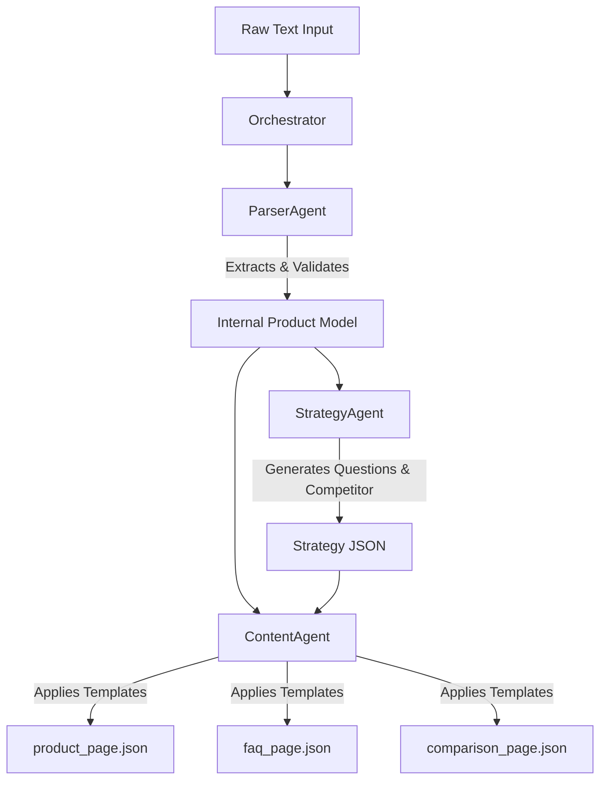

# Project Documentation: Multi-Agent Content Generation System

## 1. Problem Statement
The objective was to design and implement a modular, agentic automation system capable of transforming raw, unstructured product data into structured, machine-readable content. The system needed to autonomously generate three distinct web page types (Product Page, FAQ, Comparison) without human intervention, ensuring strict adherence to specific JSON schemas. The challenge emphasized system design, modularity, and the orchestration of multiple AI agents over simple script-based prompting.

## 2. Solution Overview
I architected a **Multi-Agent System (MAS)** that operates as a Directed Acyclic Graph (DAG). The solution is not a monolithic script but a pipeline of specialized agents, each with a single responsibility:

- **Parser Agent:** Ingests raw text and converts it into a strictly validated internal data model (`ProductData`).
- **Strategy Agent:** Analyzes the structured data to generate creative assets (User Questions and Competitor Analysis) that were not present in the source text.
- **Content Agent:** Synthesizes the data from the previous two agents to populate specific templates (`FAQ`, `Comparison`, `Product Page`) and output clean JSON.

The system is built using **Python**, **Streamlit** for the UI, and **Google Gemini** as the LLM backbone.

## 3. Scopes & Assumptions
- **Scope:** The system is designed to handle short-form product descriptions (approx. 100–300 words) typical of e-commerce listings.
- **Assumption 1 (Input Fidelity):** It is assumed that the input text contains at least a Product Name and Price. Other fields (like Side Effects) are treated as optional/nullable.
- **Assumption 2 (Currency):** The Strategy Agent assumes the competitor product should match the currency of the input product to ensure valid comparisons.
- **Assumption 3 (No External Research):** As per assignment constraints, agents do not browse the live web; they rely on internal logic and the provided dataset to generate “fictional” but realistic competitor data.

## 4. System Design
The architecture follows a modular **Orchestrator-Worker** pattern, ensuring clear agent boundaries and reusable logic.

### 4.1 Architecture Diagram

### 4.2 Agent Boundaries & Responsibilities

| Agent Name       | Input                      | Responsibility                                                                 | Output              |
|------------------|----------------------------|-------------------------------------------------------------------------------|---------------------|
| **Parser Agent**   | Raw String                 | Clean, validate, and structure data into a Pydantic object                     | ProductData Object  |
| **Strategy Agent** | ProductData                | Ideate missing content (FAQs) and generate synthetic competitor data           | StrategyDict        |
| **Content Agent**  | ProductData + StrategyDict | Apply final page templates and serialize structured output into JSON format    | JSON Files          |

---

### 4.3 Reusable Logic Blocks

To ensure modularity, eliminate redundancy, and improve extensibility, reusable logic is centralized inside:

 `src/blocks/`

#### Extraction Logic (`extraction_rules.py`)
- Uses regex-based pattern detection to extract JSON safely.
- Cleans responses when the LLM includes:
  - Markdown formatting
  - Additional sentences around the JSON
  - Broken or partial JSON formatting

#### Generation Rules (`generation_rules.py`)
Ensures consistent formatting standards:

- Currency normalization
- Comparison matrix alignment
- FAQ tone, question format, and style consistency

These rules ensure each output is predictable and production-ready.

---

### 4.4 Data Flow & Orchestration

The `ContentAutomationGraph` class orchestrates communication between all agents and manages pipeline execution.

#### **Pipeline Execution Steps:**

1. **Ingest:**  
   Raw unstructured text is received as input.

2. **Parse:**  
   `ParserAgent` extracts and validates fields into a structured Pydantic schema.  
   - If validation fails → pipeline stops with an error.

3. **Strategize:**  
   The validated `ProductData` is sent to the `StrategyAgent` to generate:  
   - Competitor dataset  
   - Missing FAQs  
   - Creative user question patterns  

4. **Generate:**  
   The `ContentAgent` composes final structured output into three JSON files:

| Output Type | File |
|------------|-------|
| Product Page | `product_page.json` |
| FAQ Page | `faq_page.json` |
| Comparison Page | `comparison_page.json` |

