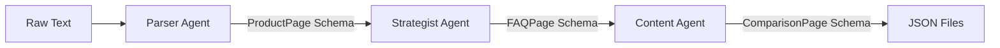

# Project Documentation: Agentic Content System 

## 1. Problem Statement
The objective was to design a production-grade **Agentic Automation System** to transform unstructured product data into structured, machine-readable web content (JSON). The system must autonomously generate Product Pages, FAQs (20+ items), and Competitor Comparisons without human intervention. Crucially, the solution required adherence to a strict agentic framework to ensure modularity, scalability, and type safety.

## 2. Solution Overview
Unlike monolithic script-based approaches, this solution utilizes the **CrewAI Framework** to orchestrate a team of specialized AI agents. The system replaces manual orchestration with an autonomous crew that delegates tasks based on roles.

**Key Technical Components:**
* **CrewAI:** Manages agent roles, memory, task delegation, and sequential process orchestration.
* **Pydantic:** Enforces strict output parsing, ensuring the LLM generates valid JSON schemas every time (no regex hacking).
* **LangChain Google GenAI:** Interfaces with the Gemini 2.5 Flash model for high-speed inference.
* **Streamlit:** Provides a user-friendly frontend interface for real-time interaction.
* **Pytest:** Validates data models and ensures constraints are met before deployment.

## 3. Scopes & Assumptions
* **Scope:** The system is designed to handle short-form product descriptions typical of e-commerce listings.
* **Assumption:** The Gemini API key is provided via `.env` or the UI.
* **Constraint:** The system mimics a real-world production environment by using "Retries" and "Structured Outputs" to prevent hallucinations and strictly follows the "No External Research" rule.

## 4. System Design

### 4.1 Architecture (CrewAI Flow)
The system follows a **Sequential Process** where data flows through specialized agents in a deterministic path.


# 4.2 Agent Roles & Responsibilities

| **Agent Role Name** | **Goal** | **Framework / Tools** |
|---------------------|----------|------------------------|
| **Parser Agent** <br> *Senior Data Analyst* | Extract factual data from raw text and validate it against the **ProductPage** Pydantic model to ensure 100% accuracy. | CrewAI + Pydantic |
| **Strategy Agent** <br> *Content Strategist* | Ideate **20+ unique FAQs** and marketing angles based on the parsed data. Validates output against the **FAQPage** model. | CrewAI + Pydantic |
| **Writer Agent** <br> *Senior Copywriter* | Create fictional competitor data and write compelling, SEO-optimized copy. Validates output against the **ComparisonPage** model. | CrewAI + Pydantic |


---

# 4.3 Data Flow & Robustness

### **Ingestion**
Raw text is passed to the **ContentGenCrew** for processing.

### **Execution**
The **CrewAI engine** activates agents sequentially to perform their assigned tasks.

### **Validation (The Safety Layer)**
- Each agent's output is validated through a **Pydantic Output Parser**.  
- If the LLM generates invalid JSON (e.g., missing required fields), **CrewAI automatically triggers a self-correction loop** to fix the error.  
- **Fallback Mechanism:** In rare cases where strict parsing still fails, a custom fallback preserves the raw text to ensure the pipeline does not crash.

---

# 5. Testing & Quality Assurance

A dedicated **`tests/`** directory ensures the system's reliability using **Pytest**.

### **Schema Validation**
Tests confirm that:
- `ProductPage`, `FAQPage`, and `ComparisonPage` models correctly **reject invalid data types**.

### **Constraint Checks**
Tests verify that:
- Required fields — such as **price** or **description** — **cannot be omitted**.

### **Logic Verification**
Unit tests ensure:
- The **comparison table structure** aligns with the expected format.

---

# 6. How to Run

### **Install Dependencies**
```bash
pip install -r requirements.txt
```
### **Run Test**
```bash
python -m pytest
```
### **Launch App**
```bash
streamlit run app.py
```


